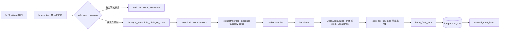

# Lifers 任务流（taskflow）：分类 · 分发 · 处理 · 学习

## 总览

- **输入**（`bridge_turn.py`）：`context_files` 安全读入 → `--- user message ---` 拼接；`LIFERS_TASKFLOW` / `LIFERS_QUICK_WEB` / `LIFERS_FORCE_LOCAL_ONLY` 等见模块注释。
- **对话推理分发**（`dialogue_router.py` + `daily_intents.py`）：与 `Planner` / 本能启发式对齐，产出 `TaskKind` + `reason`/`notes_zh`；stderr 打 `LIFERS_PROGRESS dialogue_route {...}`。**业务规则只加在这两处**；`classify.py` 仅 `split_user_message` + `classify_task` → `infer_dialogue_route` 薄封装，避免重复分支。
- **推理阶段日志**（`inference_pipeline.py`）：编排器在路由后打 `LIFERS_PROGRESS inference`（如 `taskflow_route`）；`agent` 内另有 `transformer_generate_*` 等细粒度进度。
- **输出**：`bridge_turn._strip_api_key_nag_when_local_only` 在强制本地模式下去除误导性「须配云端密钥」段落；CHAT_QUICK 另有 `LIFERS_QUICK_CHAT_OUT_CHARS` 等环境变量收紧体量（见 `agent`）。
- **实时 vs 快照**：`【大脑方案】` 含 **【上下文时效】**（方案头生成时刻）；**【记忆快照】** 标明长期记忆来自 SQLite 历史；`LONGTERM_RECALL` 段首标注检索时刻。`real_world` 天气/地图与 `web_search` 摘要附 **抓取时刻**（`fetched_at_ms`）。物化 `run_embodied_tick` 返回 `as_of_unix_ms`。
- **分发**（`dispatcher.py`）：`TaskKind` → 对应 `handlers/*.py` 的 `handle(ctx)`。
- **智脑**：`CHAT_QUICK` 走 `quick_chat()`（短对话）；其余类型走 `step(agent_input)`（完整工具链与头尾本能）。
- **学习**（`learn.py`）：每轮将 `kind`、用户摘录、回复摘录写入长期记忆 `type=taskflow`（可用 `LIFERS_TASKFLOW_LEARN=0` 关闭）。
- **深层保障**（`steward.py`）：学习后按 `stack.brain.deep_steward` 自动删减重 `taskflow` 旧记录；`LIFERS_STEWARD=0` 可关。
- **联网**：`tools` 使用 `urllib.request.getproxies()` + 自定义 opener，不绑定浏览器；`web_search` 先试 DuckDuckGo Instant JSON，再退回 HTML。

## AI 管线完整清单（输入 → 语义 → 推理 → 输出）

机读索引：**`config/lifers_ai_pipeline.json`**（含各阶段源码路径、配置锚点、stderr 标签、聚合自检命令）。以下为与之一一对应的总表，便于人工审计「无遗漏」。

| 阶段 | 职责 | 关键源码 | 关键配置 / 环境 |
|------|------|-----------|-----------------|
| **输入** | JSON 解析、上下文文件拼接、Bridge 环境闸 | `bridge_turn.py`、`chat_messages.py` | `LIFERS_CONTEXT_MAX_FILES`、`LIFERS_TASKFLOW`、`LIFERS_FORCE_LOCAL_ONLY`、`LIFERS_AGENTS_UI_BRIDGE` |
| **语义** | TaskKind 推断、与 Planner 口令对齐、stderr 路由可观测 | `orchestrator.py`、`dialogue_router.py`、`daily_intents.py`、`classify.py`（薄封装） | `organ_capabilities.json`、`domains.json` |
| **推理** | 工具链 / CHAT_QUICK、LocalBrain、可选远程 chat、本能与生理注入 | `agent.py`（`Planner`、`step`、`quick_chat`）、`inference_pipeline.py`、`transformer_lm.py` / `markov_lm.py`、`openai_compat_chat.py` | `stack.json#brain`、`MODEL`、`SANDBOX`、`remote_infer` |
| **输出** | 工具摘要、方案头时效、记忆/抓取时刻标注、本地模式去噪、快路径脚注 | `bridge_turn._strip_api_key_nag_when_local_only`、`agent._tool_first_answer`、`_format_plan_header`、`_append_quick_reply_time_footer` | `LIFERS_QUICK_*`、`LIFERS_QUICK_TIME_FOOTER` |
| **Agent 总控** | 会话、长期记忆、scratch、工具注册表、栈装载 | `memory.py`、`tools.py`、`stack_env.py`、`instincts.py` | `stack.json#runtime`、`#instincts`、`#human_sim` |
| **边缘** | 大权重首包、prompt 裁剪、本地 generate 墙钟、Bridge 外层超时、路由烟测、扩展 Kali 总控 | `verify_edge_agent_pipeline.py`、`extension.js`（Agents UI） | `meta.bridge_io_audit`、`llm_ops`、`LIFERS_QUICK_PACK_MAX_CHARS`、`LIFERS_QUICK_GENERATE_TIMEOUT_SEC`、`lifers.bridgeTimeoutMs` |
| **物化 / NPC** | 与对话并行 tick、训练控制对齐、动态 NPC 占位说明 | `embodied/coordinator.py`、`physics.py`、`vision.py`、`embodied_tick_once.py` | `stack.json#embodied_world`、`dynamic_npc`、`weights/.train_control`；**隔离真 tick**：`tests/test_embodied_smoke.py`（临时目录启用 `embodied_world` + `run`，不污染仓库 `state/`） |

**聚合自检（建议发版前全跑）**：`lifers_run_all_checks.py` → unittest + `verify_edge_agent_pipeline.py` + `check_lifers_llm_ready.py` + `full_system_check.py`（子进程**强制** `LIFERS_FULL_CHECK_BRIDGE=1`，避免父 shell 曾 export `=0` 时跳过 `agent_bridge_once`）+ `embodied_tick_once.py`；单次配置与健康度 **`python scripts/lifers_verify_config.py`**（输出含 `ai_pipeline`、`embodied_world`、`tool_registry`）。

## 外部审计陈述对照（摘要）

以下为与仓库事实一致的纠偏，便于对照幻灯/自查表：

| 陈述 | 实际情况 |
|------|----------|
| 「无 tokenizer」 | 本地 TinyTransformer 词表在 **`weights/lifers_transformer.json` 的 `vocab` 数组**；无需单独 tokenizer 配置文件。采样默认见 **`stack.json` → `brain.local_lm_sampling`**。 |
| 「无意图路由」 | **`dialogue_router.infer_dialogue_route`** + **`Planner`** 决定 `TaskKind`；stderr 先有 **`route_coarse`**（粗桶），再有 **`dialogue_route`**。不是仅靠 `remoteChat`。 |
| 「无工具 / 无函数调用」 | **`lifers_brain/tools.py`** `build_default_registry()`；`TOOL_PLAN` / `step` 下调度工具。 |
| 「memory 只写不检索」 | **`kb_search`**、CHAT_QUICK 预检索等走 **`memory.py`** / 管线配置；审计若只看 SQLite 文件易误判。 |
| 「SANDBOX 无实现」 | **`SANDBOX=1`** 下工具执行路径受限（如 `web_search` 沙盒行为）；非浏览器级隔离。 |
| 「Gate 未上传」 | HTTP 入口为 **`lifers_brain/scripts/lifers_gate.py`**（默认 `127.0.0.1:55555`），契约与 `agent_bridge_once` 同源 JSON。 |
| 「bridge_once 无会话」 | 设计为 **stdin 单次子进程**；会话状态在扩展侧 JSON + SQLite；持久 HTTP 用 **lifers_gate** 或 **lifers_gui_host**。 |
| 「bridgeTimeoutMs 应 60s」 | 外层等待整次 Python；大 transformer 冷启动常 **>60s**。缩短请同步调高 **`LIFERS_QUICK_GENERATE_TIMEOUT_SEC`** / **`lifers.edgeGenerateTimeoutSec`**，否则会先触发内层超时。 |
| 「流式输出」 | 当前 Bridge **整段 JSON 返回**；流式需另行协议（roadmap）。 |
| 「动态 NPC 全无文件」 | **`embodied/`**、`embodied_tick_once.py`、`stack.embodied_world.dynamic_npc` 占位；多体 NPC 仍为路线图。 |

## 环境变量

| 变量 | 默认 | 含义 |
|------|------|------|
| `LIFERS_TASKFLOW` | `1` | `0/false/no/off` 时桥接直接 `agent.step`，不走路由 |
| `LIFERS_TASKFLOW_LEARN` | `1` | `0` 关闭写入长期记忆 |
| `LIFERS_STEWARD` | `1` | `0` 关闭学习后的 taskflow 修剪 |
| `LIFERS_SELF_HEAL` | `1` | `0` 关闭启动时对 `stack.json` 的缺失键合并与损坏恢复 |
| `LIFERS_SELF_CODE_QUEUE` | `1` | `0` 关闭桥接前消费 `state/self_code_queue/*.json` 自改文件 |
| `LIFERS_FILE_JOURNAL` | `1` | `0` 时写文件改为目标旁 `.bak` 临时备份（仍带写失败回滚） |
| `HTTPS_PROXY` / `HTTP_PROXY` | （系统） | 公司网/防火墙时由系统或环境指定，非固定「某浏览器」 |
| `LIFERS_QUICK_TIME_FOOTER` | **auto** | `1/0` 强制开关；未设时若 `LIFERS_AGENTS_UI_BRIDGE=1` 则在 **CHAT_QUICK** 用户可见回复末追加 **【本轮·生成锚】**（本机生成时刻） |
| `LIFERS_QUICK_GENERATE_TIMEOUT_SEC` | **POSIX 未设时约 120**（秒） | CHAT_QUICK 本地 transformer **内层**墙钟上限；`0` 关闭。Agents 扩展非 0 的 **`lifers.edgeGenerateTimeoutSec`** 会注入本变量。与扩展 **`lifers.bridgeTimeoutMs`**（整次 Bridge **外层**毫秒）独立。 |

## 日常操作入口（类人分工）

| 场景 | 用户侧典型写法 | 路由或行为 |
|------|------------------|------------|
| 短聊、日常语气 | 任意短句，无工具形态 | `CHAT_QUICK`；知识/元问题可触发自动 `web_search` |
| 显式联网 | `search …`、中文「搜索/搜一下/查查/查询…」「搜 …」 | `WEB_SEARCH` → `step` |
| 记忆 + 网 | `流程…` / `workflow …` | `WORKFLOW_DUAL` |
| 长文、翻译、备忘 | `总结/续写/翻译/待办/提醒我…` 等 | `FULL_PIPELINE` |
| 做游戏 / 写程序 / 搭站点等项目向实现 | 「做一个…游戏」「开发…应用」等（否定句见 `daily_intents.looks_like_build_or_code_request`） | `FULL_PIPELINE`（`build_or_code_project`） |
| 时钟天气地图 | 「几点」「天气」「地图」等 | `REAL_WORLD` 或本能注入 |
| 读文件/路径 | 消息中含可解析路径 | `FS_PATH` / `fs_read` |
| 打开网页 | 消息中含 `https://` | `URL_FETCH` |
| 壳命令 | `cmd …` | `CMD_SHELL` |
| 自改工作区内文件（含 .py） | 首行 `rel_write`/`workspace_write`/`self_write` + 路径，正文从第二行起；或队列 JSON | `TOOL_PLAN` → `lifers_workspace_write`；`apply_stack_env` 前消费 `state/self_code_queue` |

更细的条目见仓库 `config/organ_capabilities.json` 的 `daily_operations_surface_zh`。

## 自动学习、自动增删、自修复（边界说明）

- **自动写入（学）**：`learn.py` 每轮成功回复后写入 `type=taskflow`（可关 `LIFERS_TASKFLOW_LEARN`）。本能层 `instincts.py` 在空闲阶梯上写入 `reflection` / `instinct` 等（见 `stack.instincts`）。
- **自动删除（忘）**：`steward_after_learn` 按天删旧 `taskflow`；`brain.deep_steward.global_forget` 对**低重要性且过旧**的任意类型记忆调用 `LongTermMemory.prune`。`global_forget.auto_threshold.enabled` 时按 `memories` 总行数动态下调 `min_importance`、缩短天数、提高 `limit`（见 `steward._resolve_global_forget_params`）。需长期保留的记忆应提高 `importance`。scratch 由 `operations_trim_scratchpad` 限长。
- **自改源码（显式通道）**：`SANDBOX=0` 下工具 **`lifers_workspace_write`**（`rel_path` + `new_text`）与对话格式 **`rel_write` / `workspace_write` / `self_write`**（首行路径、正文从第二行起）；或 **`state/self_code_queue/*.json`** 由 `bridge_turn` 在每轮前自动写入（`brain.self_code`、`LIFERS_SELF_CODE_QUEUE`）。不设「禁止改 .py」——由宿主与权限自担风险。
- **自修复（仅 stack）**：`self_heal.py` 合并缺失键、损坏时从包内模板恢复 `stack.json`。

## 类型与处理库对应

| TaskKind | 处理模块 | 执行方式 |
|----------|-----------|----------|
| `CHAT_QUICK` | `handlers/chat_quick.py` | `quick_chat(user_text)`（默认不写 taskflow 记忆、不跑 steward，避免 Bridge 被 SQLite 管家拖慢；`LIFERS_QUICK_CHAT_LEARN=1` 可恢复） |
| `PLAN_PREVIEW` | `handlers/plan_preview.py` | `step` |
| `SMART_SEARCH` | `handlers/smart_search.py` | `step` |
| `WORKFLOW_DUAL` | `handlers/workflow_dual.py` | `step` |
| `KB_CLI` | `handlers/kb_cli.py` | `step` |
| `CMD_SHELL` | `handlers/cmd_shell.py` | `step` |
| `SIM_RUN` | `handlers/sim_run.py` | `step` |
| `URL_FETCH` | `handlers/url_fetch.py` | `step` |
| `WEB_SEARCH` | `handlers/web_search.py` | `step` |
| `FS_PATH` | `handlers/fs_path.py` | `step` |
| `REAL_WORLD` | `handlers/real_world.py` | `step` |
| `TOOL_PLAN` | `handlers/tool_plan.py` | `step` |
| `FULL_PIPELINE` | `handlers/full_pipeline.py` | `step`（含上下文前缀等兜底） |

当前除 `CHAT_QUICK` 外，各库统一委托 `step`；后续可把重型逻辑从 `agent._step_core` 拆入对应 handler，而不改桥接接口。

## 注册工具（ToolRegistry，与 Planner 可调用的 name 对齐）

| name | 类（`tools.py`） | 典型触发 |
|------|------------------|-----------|
| `web_search` | `WebSearchTool` | `search …`、中文检索面、`流程/workflow` 第二步、智搜后补网 |
| `web_fetch` | `WebFetchTool` | 句中含 `http(s)://` |
| `extract_evidence` | `ExtractEvidenceTool` | 紧随 `web_fetch` 的摘要链 |
| `fs_read` | `FsReadTool` | 路径形态 token |
| `fs_write_patch` | `FsWritePatchTool` | Planner / 工具链（补丁写） |
| `lifers_workspace_write` | `LifersWorkspaceWriteTool` | `rel_write` / `workspace_write` / `self_write` 首行口令 |
| `cmd_run` | `CmdRunTool` | `cmd …` |
| `kb_upsert` / `kb_search` / `kb_prune` / `kb_compact` | `Kb*` | 学习写入、`kb_*` 前缀、`kb_compact` 摘要入库 |
| `sim_run` | `SimRunTool` | `sim_run …` |
| `sense_snapshot` / `motion_plan` / `motion_execute` / `manipulate` / `safety_stop` | 机器人桩 | 配置 `robot.*_exec_cmd` 或占位 |
| `real_world` | `RealWorldTool` | `Planner.plan_real_world_instinct`（时钟/天气/地图） |

**编排（不产生新 tool name）**：`smart`/`智搜` 在 `agent._step_core` 内手写 `kb_search`→条件 `web_search`；`流程`/`workflow` 在 `Planner.plan` 固定两步。详见 `lifers_brain/tools.py` 模块注释与 `config/domains.json`。

## 单一事实来源（防重复实现）

| 主题 | 权威位置 | 说明 |
|------|-----------|------|
| TaskKind 与中文路由规则 | `dialogue_router.py`、`daily_intents.py` | 勿在 `classify.py` 复制一套 if/else；`eval/full_system_check.py` 经 `classify_task` 仍命中同一入口。 |
| **工具名与执行体** | **`tools.py` → `build_default_registry()`** | **`domains.json` / `organ_capabilities.json` 仅映射**；对账 `tests/test_tools_registry.py` 与 `scripts/lifers_verify_config.py` 的 `tool_registry`。 |
| 边缘对话体积 / 路由烟测 | `scripts/verify_edge_agent_pipeline.py` | 与扩展里 Kali/SSH 说明互补，不重复实现路由。 |
| 物化世界与动态 NPC | `stack.embodied_world`、`scripts/embodied_tick_once.py`、`embodied/coordinator.py` | `dynamic_npc` 仅占位；多体逻辑待扩展 PhysWorld，见 `stack.json` meta 与 **`config/lifers_ai_pipeline.json#embodied_npc`**。 |

## 扩展方式

1. 在 `kinds.py` 增加枚举值（若需要新类型）。
2. 在 `dialogue_router.py` 与/或 `daily_intents.py` 增加判定（**不要**在 `classify.py` 写重复规则）。
3. 新建 `handlers/your_kind.py` 实现 `handle(ctx) -> HandlerResult`。
4. 在 `handlers/__init__.py` 的 `build_default_dispatcher()` 中注册路由。
5. 更新 `tests/test_dialogue_router.py`、`tests/test_tools_registry.py`、`tests/test_ai_pipeline_json.py` 与（如适用）`config/domains.json`、`config/organ_capabilities.json`、`config/lifers_ai_pipeline.json`。
