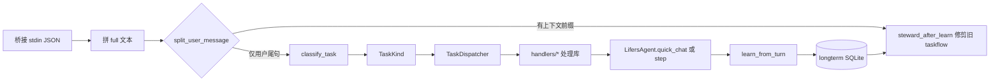

# Lifers 任务流（taskflow）：分类 · 分发 · 处理 · 学习

## 总览

- **分类**（`classify.py`）：与 `Planner` / 本能启发式对齐，产出 `TaskKind`。
- **分发**（`dispatcher.py`）：`TaskKind` → 对应 `handlers/*.py` 的 `handle(ctx)`。
- **智脑**：`CHAT_QUICK` 走 `quick_chat()`（短对话）；其余类型走 `step(agent_input)`（完整工具链与头尾本能）。
- **学习**（`learn.py`）：每轮将 `kind`、用户摘录、回复摘录写入长期记忆 `type=taskflow`（可用 `LIFERS_TASKFLOW_LEARN=0` 关闭）。
- **深层保障**（`steward.py`）：学习后按 `stack.brain.deep_steward` 自动删减重 `taskflow` 旧记录；`LIFERS_STEWARD=0` 可关。
- **联网**：`tools` 使用 `urllib.request.getproxies()` + 自定义 opener，不绑定浏览器；`web_search` 先试 DuckDuckGo Instant JSON，再退回 HTML。

## 环境变量

| 变量 | 默认 | 含义 |
|------|------|------|
| `LIFERS_TASKFLOW` | `1` | `0/false/no/off` 时桥接直接 `agent.step`，不走路由 |
| `LIFERS_TASKFLOW_LEARN` | `1` | `0` 关闭写入长期记忆 |
| `LIFERS_STEWARD` | `1` | `0` 关闭学习后的 taskflow 修剪 |
| `LIFERS_SELF_HEAL` | `1` | `0` 关闭启动时对 `stack.json` 的缺失键合并与损坏恢复 |
| `LIFERS_SELF_CODE_QUEUE` | `1` | `0` 关闭桥接前消费 `state/self_code_queue/*.json` 自改文件 |
| `LIFERS_FILE_JOURNAL` | `1` | `0` 时写文件改为目标旁 `.bak` 临时备份（仍带写失败回滚） |
| `HTTPS_PROXY` / `HTTP_PROXY` | （系统） | 公司网/防火墙时由系统或环境指定，非固定「某浏览器」 |

## 日常操作入口（类人分工）

| 场景 | 用户侧典型写法 | 路由或行为 |
|------|------------------|------------|
| 短聊、日常语气 | 任意短句，无工具形态 | `CHAT_QUICK`；知识/元问题可触发自动 `web_search` |
| 显式联网 | `search …`、中文「搜索/搜一下/查查/查询…」「搜 …」 | `WEB_SEARCH` → `step` |
| 记忆 + 网 | `流程…` / `workflow …` | `WORKFLOW_DUAL` |
| 长文、翻译、备忘 | `总结/续写/翻译/待办/提醒我…` 等 | `FULL_PIPELINE` |
| 时钟天气地图 | 「几点」「天气」「地图」等 | `REAL_WORLD` 或本能注入 |
| 读文件/路径 | 消息中含可解析路径 | `FS_PATH` / `fs_read` |
| 打开网页 | 消息中含 `https://` | `URL_FETCH` |
| 壳命令 | `cmd …` | `CMD_SHELL` |
| 自改工作区内文件（含 .py） | 首行 `rel_write`/`workspace_write`/`self_write` + 路径，正文从第二行起；或队列 JSON | `TOOL_PLAN` → `lifers_workspace_write`；`apply_stack_env` 前消费 `state/self_code_queue` |

更细的条目见仓库 `config/organ_capabilities.json` 的 `daily_operations_surface_zh`。

## 自动学习、自动增删、自修复（边界说明）

- **自动写入（学）**：`learn.py` 每轮成功回复后写入 `type=taskflow`（可关 `LIFERS_TASKFLOW_LEARN`）。本能层 `instincts.py` 在空闲阶梯上写入 `reflection` / `instinct` 等（见 `stack.instincts`）。
- **自动删除（忘）**：`steward_after_learn` 按天删旧 `taskflow`；`brain.deep_steward.global_forget` 对**低重要性且过旧**的任意类型记忆调用 `LongTermMemory.prune`。`global_forget.auto_threshold.enabled` 时按 `memories` 总行数动态下调 `min_importance`、缩短天数、提高 `limit`（见 `steward._resolve_global_forget_params`）。需长期保留的记忆应提高 `importance`。scratch 由 `operations_trim_scratchpad` 限长。
- **自改源码（显式通道）**：`SANDBOX=0` 下工具 **`lifers_workspace_write`**（`rel_path` + `new_text`）与对话格式 **`rel_write` / `workspace_write` / `self_write`**（首行路径、正文从第二行起）；或 **`state/self_code_queue/*.json`** 由 `bridge_turn` 在每轮前自动写入（`brain.self_code`、`LIFERS_SELF_CODE_QUEUE`）。不设「禁止改 .py」——由宿主与权限自担风险。
- **自修复（仅 stack）**：`self_heal.py` 合并缺失键、损坏时从包内模板恢复 `stack.json`。

## 类型与处理库对应

| TaskKind | 处理模块 | 执行方式 |
|----------|-----------|----------|
| `CHAT_QUICK` | `handlers/chat_quick.py` | `quick_chat(user_text)` |
| `PLAN_PREVIEW` | `handlers/plan_preview.py` | `step` |
| `SMART_SEARCH` | `handlers/smart_search.py` | `step` |
| `WORKFLOW_DUAL` | `handlers/workflow_dual.py` | `step` |
| `KB_CLI` | `handlers/kb_cli.py` | `step` |
| `CMD_SHELL` | `handlers/cmd_shell.py` | `step` |
| `SIM_RUN` | `handlers/sim_run.py` | `step` |
| `URL_FETCH` | `handlers/url_fetch.py` | `step` |
| `WEB_SEARCH` | `handlers/web_search.py` | `step` |
| `FS_PATH` | `handlers/fs_path.py` | `step` |
| `REAL_WORLD` | `handlers/real_world.py` | `step` |
| `TOOL_PLAN` | `handlers/tool_plan.py` | `step` |
| `FULL_PIPELINE` | `handlers/full_pipeline.py` | `step`（含上下文前缀等兜底） |

当前除 `CHAT_QUICK` 外，各库统一委托 `step`；后续可把重型逻辑从 `agent._step_core` 拆入对应 handler，而不改桥接接口。

## 扩展方式

1. 在 `kinds.py` 增加枚举值（若需要新类型）。
2. 在 `classify.py` 增加判定分支。
3. 新建 `handlers/your_kind.py` 实现 `handle(ctx) -> HandlerResult`。
4. 在 `handlers/__init__.py` 的 `build_default_dispatcher()` 中注册路由。
